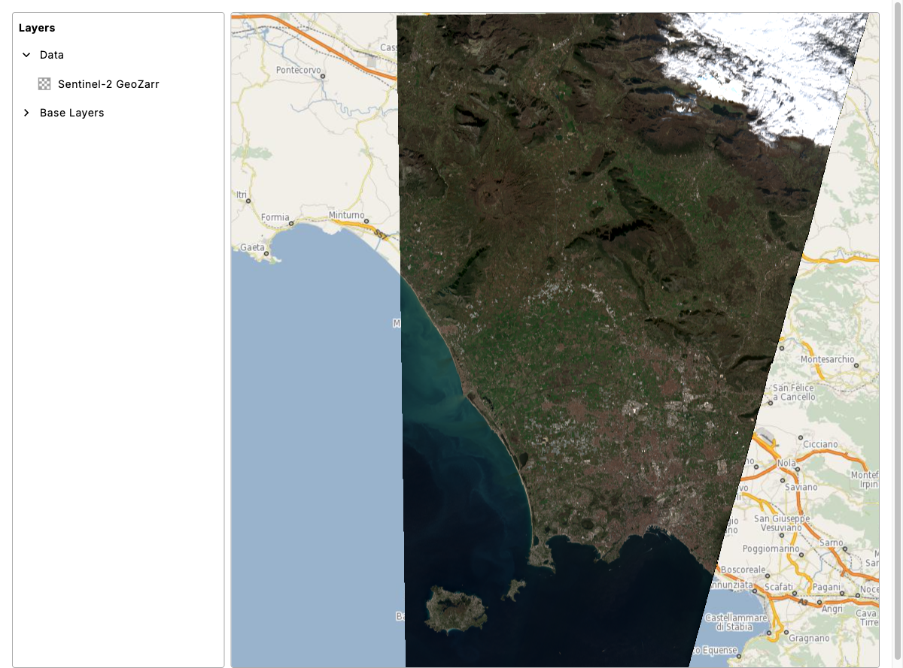

# 01: Basic Map with GeoZarr

In this exercise you'll create a map that loads Sentinel-2 data directly from a GeoZarr store on S3, with no tile server. You'll use `eox-layout` for positioning, `eox-map` for rendering, and `eox-layercontrol` for layer management.

## Result

Target result:



## Import packages

In [main.js](./main.js), import the required packages:

- `@eox/layout` — grid layout system
- `@eox/map` — map component
- `@eox/map/src/plugins/advancedLayersAndSources` — adds the `GeoZarr` source type
- `@eox/layercontrol` — layer management panel

These are bare specifiers resolved by Vite from `node_modules`. CDN equivalents via unpkg (works with any static server):

- `https://unpkg.com/@eox/layout/dist/eox-layout.js`
- `https://unpkg.com/@eox/map/dist/eox-map.js`
- `https://unpkg.com/@eox/map/dist/eox-map-advanced-layers-and-sources.js`
- `https://unpkg.com/@eox/layercontrol/dist/eox-layercontrol.js`


## Add HTML

In [index.html](./index.html), create a layout with two panels using `eox-layout` (12-column grid):

- **Left panel** (3 columns): `eox-layercontrol`
- **Right panel** (9 columns): `eox-map`

Link the layer control to the map using the `for` attribute with the pattern `for="eox-map#<map-id>"`.

Hint: use `eox-layout-item` with `x`, `y`, `w`, `h` attributes to position items in the grid.


## Configure the map layers

In [main.js](./main.js), define a layers array with two layer groups:

### Base Layers

An OpenStreetMap base layer using `XYZ` source type. The EOX tile server URL follows the pattern:
```
https://tiles.maps.eox.at/wmts/1.0.0/osm_3857/default/g/{z}/{y}/{x}.jpg
```

### Data Layer — GeoZarr

A `WebGLTile` layer with a `GeoZarr` source. Get the scene URL from
`fetchGeoZarrUrl` in `../shared/utils.js`, which returns a recent low-cloud
Sentinel-2 product for a bounding box:

```js
import { fetchGeoZarrUrl } from "../shared/utils.js";
const zarrUrl = await fetchGeoZarrUrl([14.0, 41.0, 14.2, 41.2]); // around Napoli
```

Configure it for true-color RGB using bands `["b04", "b03", "b02"]`.

For the style, you'll need to:
- Set `gamma: 1.5` for brightness correction
- Use `["interpolate", ["linear"], ["band", n], 0, 0, 0.5, 255]` to scale each band's reflectance (0-0.5) to display values (0-255)

Set `layerControlExpand: true` on the data group so it's expanded in the layer control by default.

### Key concepts

| Property | Description |
|----------|-------------|
| `type: "GeoZarr"` | Source type for loading Zarr data directly from S3 |
| `bands` | Array of band identifiers to load (e.g., `["b04", "b03", "b02"]`) |
| `["band", n]` | Access a band by 1-based index in style expressions |
| `gamma` | Brightness correction value |

## Assign to the map

Use `Object.assign` on the map element to set `layers`, `center` ([14.09, 41.1] for the Napoli area), and `zoom` (10).

## Compare

Compare with the [solution folder](./solution/).

Next, try out [section 02](../02-eox-advanced/README.md).

## Further reading

- [EOxElements Storybook](https://eox-a.github.io/EOxElements/) — full component API reference, properties, and examples