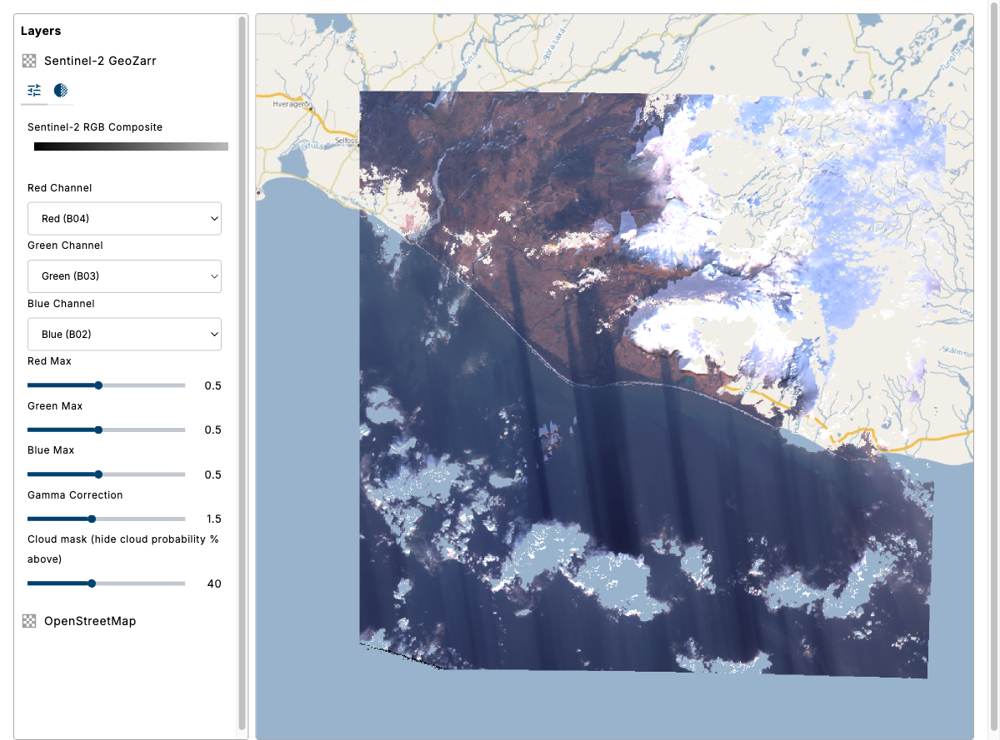

# 02: Advanced Visualization with layerConfig

In exercise 01 the band combination and styling were fixed. This exercise makes them interactive. The `layerConfig` pattern embeds a JSON Schema directly in a layer's properties; `eox-layercontrol` (via `eox-jsonform`) renders the controls and wires them to the layer's WebGL style variables.

This exercise has two parts:

- **Part A — Band manipulation**: interactive channel / max / gamma controls.
- **Part B — Multi-group**: pull a band from a *different group* of the same store and use it to mask clouds.

## Result



A layer control with dropdowns to pick the Red/Green/Blue channels and sliders for per-channel max and gamma — all driving the GeoZarr layer live.

## Import packages

Import the required packages:

- `@eox/layout` — grid layout system
- `@eox/map` — map component
- `@eox/map/src/plugins/advancedLayersAndSources` — adds the `GeoZarr` source type
- `@eox/layercontrol` — layer management panel
- `@eox/jsonform` — renders the config form from the schema (required for the `config` tool)

CDN equivalents:

- `https://unpkg.com/@eox/layout/dist/eox-layout.js`
- `https://unpkg.com/@eox/map/dist/eox-map.js`
- `https://unpkg.com/@eox/map/dist/eox-map-advanced-layers-and-sources.js`
- `https://unpkg.com/@eox/layercontrol/dist/eox-layercontrol.js`
- `https://unpkg.com/@eox/jsonform/dist/eox-jsonform.js`

## Add HTML

Reuse the two-panel layout from exercise 01. The only change is on the layer control — enable its tools:

```html
<eox-layercontrol
  for="eox-map#my-map"
  tools='["config", "opacity", "info"]'
></eox-layercontrol>
```

| Tool | What it does |
|------|--------------|
| `config` | Renders the form from `layerConfig.schema` |
| `opacity` | Layer opacity slider |
| `info` | Shows the layer description |

## Part A — The layerConfig pattern

Use a `WebGLTile` GeoZarr layer with **four** bands so the SWIR band is available too: `["b04", "b03", "b02", "b11"]`. These map to band indices 1-4 in style expressions.

On the layer's `properties`, add a `layerConfig` object with:

- `type: "style"` — form changes update the layer's style `variables`
- `schema` — a JSON Schema whose properties become form controls:
  - `red` / `green` / `blue`: `type: "number"`, `enum: [1, 2, 3, 4]`, with `options.enum_titles` of `["Red (B04)", "Green (B03)", "Blue (B02)", "SWIR (B11)"]` — these render as dropdowns
  - `redMax` / `greenMax` / `blueMax` / `gamma`: `type: "number"` with `format: "range"` — these render as sliders

The form is rendered by `eox-jsonform`, built on [`@json-editor/json-editor`](https://github.com/json-editor/json-editor). Field types, `format`s, validation, and nested objects from that library are all available in your `schema`. See the [eox-jsonform docs](https://eox-a.github.io/EOxElements/?path=/docs/elements-eox-jsonform--docs) for the full reference.

Also set `layerControlExpand: true` and `layerControlToolsExpand: true` to start the layer and its tools expanded.

### Wiring the schema to the style

The form updates **style variables**, so the layer `style` must declare matching `variables` and reference them with `["var", "..."]`:

```js
style: {
  variables: { red: 1, green: 2, blue: 3, redMax: 0.5, greenMax: 0.5, blueMax: 0.5, gamma: 1.5 },
  gamma: ["var", "gamma"],
  color: [
    "color",
    ["interpolate", ["linear"], ["band", ["var", "red"]],   0, 0, ["var", "redMax"],   255],
    ["interpolate", ["linear"], ["band", ["var", "green"]], 0, 0, ["var", "greenMax"], 255],
    ["interpolate", ["linear"], ["band", ["var", "blue"]],  0, 0, ["var", "blueMax"],  255],
  ],
}
```

`["band", ["var", "red"]]` reads the band index held by the `red` variable; changing the dropdown re-renders the composite.

## Assign and explore

Assign the layers and set `center: [14.52, 49.08]`, `zoom: 8` (Czech Republic, south Bohemia).

Open the layer's config tool and try a false-color SWIR composite: set Red → SWIR (B11), Green → Red (B04), Blue → Green (B03). Vegetation and moisture respond differently from true color.

## Part B — Combine bands from another group

A GeoZarr store is a tree of groups. Every band so far came from `measurements/reflectance`. The same store also has a `quality/probability` group containing a per-pixel cloud probability band (`cld`, in %). That band can be pulled into the same layer to mask clouds.

Switch the source to multi-group form: point `url` at the store root (drop the `/measurements/reflectance` suffix) and assign each band its own `group`:

```js
source: {
  type: "GeoZarr",
  url: storeUrl, // store root
  bands: [
    { name: "b04", group: "measurements/reflectance" },
    { name: "b03", group: "measurements/reflectance" },
    { name: "b02", group: "measurements/reflectance" },
    { name: "b11", group: "measurements/reflectance" },
    { name: "cld", group: "quality/probability" }, // cloud probability %, band 5
  ],
}
```

Bands retain their declared order, so `cld` is band index `5`. The map resamples it onto the reference grid automatically, even though it is a coarser (20 m) band.

Now add a **cloud threshold** control — a slider that hides cloudy pixels:

- Add a schema property `cloudThreshold` (`type: "number"`, `format: "range"`, `minimum: 0`, `maximum: 100`, `default: 100`.
- Add a matching style variable `cloudThreshold: 100`.
- Add an alpha channel that hides pixels where the cloud probability exceeds the threshold:

```js
["case", [">", ["band", 5], ["var", "cloudThreshold"]], 0, 1],
```

Lower the threshold to mask increasingly confident cloud pixels, exposing the surface and OSM base underneath. The technique is the same as the [OpenLayers GeoZarr groups example](https://openlayers.org/en/latest/examples/geozarr-groups.html): one layer, bands from two groups, combined in a single WebGL style expression.

## Compare

Compare with the [solution folder](./solution/).

Next: [exercise 03](../03-eox-globe/README.md).

## Further reading

- [eox-layercontrol docs](https://eox-a.github.io/EOxElements/?path=/docs/elements-eox-layercontrol--docs) — tools, layerConfig, and more
- [eox-jsonform docs](https://eox-a.github.io/EOxElements/?path=/docs/elements-eox-jsonform--docs) — the form component behind the `config` tool
- [@json-editor/json-editor](https://github.com/json-editor/json-editor) — the underlying schema/form library
