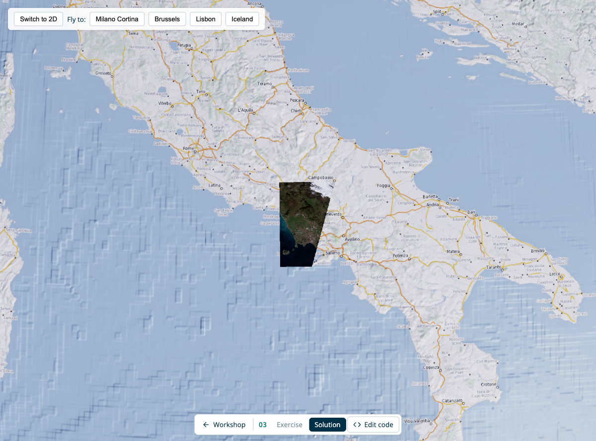

# 03: 3D Globe

Switching from a 2D map to a 3D globe in `eox-map` requires changing the projection and loading the globe plugin. The plugin adds a second rendering engine ([OpenGlobus](https://www.openglobus.org/)) that projects OpenLayers layers onto a 3D Earth.

## Result



Sentinel-2 GeoZarr scenes draped over a 3D globe — one at each fly-to location — with a toolbar to toggle 2D/3D and fly between them.

## Import packages

- `@eox/map` — the map component
- `@eox/map/src/plugins/globe` — adds the `"globe"` projection
- `@eox/map/src/plugins/advancedLayersAndSources` — adds the `GeoZarr` source type
- `@openglobus/og` — only needed for the fly-to feature (`LonLat`)

CDN equivalents for the plugins:

- `https://unpkg.com/@eox/map/dist/eox-map-globe.js`
- `https://unpkg.com/@eox/map/dist/eox-map-advanced-layers-and-sources.js`

## Add HTML

A single full-bleed map is enough. It starts in 2D; the toggle button switches it to the globe:

```html
<eox-map id="globe" projection="EPSG:3857"></eox-map>
```

An overlay toolbar with the 2D/3D toggle and the fly-to buttons is provided (the fly-to buttons carry `data-lon` / `data-lat` attributes).

## Configure the globe

The globe projects your OpenLayers layers automatically. Use:

- OpenStreetMap base (`Tile` + `XYZ`, same URL as previous exercises). Set
  `source.crossOrigin = "anonymous"` so the globe engine can read the tile pixels.
- One Sentinel-2 GeoZarr per fly-to location (`WebGLTile` + `GeoZarr` source, bands
  `["b04", "b03", "b02"]`, same true-colour style as exercise 01). Fetch a scene URL
  for each location's bbox with `fetchGeoZarrUrl`, e.g. `await Promise.all(...)`, then
  map the locations to layers. The `GeoZarr` source comes from the advanced
  layers/sources plugin.

Then on the map element:

- assign the `layers`
- set `center: [12.12, 46.54]` and `zoom: 7` to frame the first scene (Milano Cortina)

The map loads in 2D; terrain is enabled when you first switch to the globe.

> Tip: once on the globe, right-click and drag to tilt it.

## Interactivity

- **Toggle 2D/3D** — wire the provided toggle button: flip `map.projection` between `"EPSG:3857"` and `"globe"`, and enable terrain (`map.globeConfig.terrain = true`) when entering the globe.

## How it works

`eox-map` keeps a single OpenLayers instance as the source of truth for layer state. By default each layer is rendered natively in OpenGlobus (e.g. XYZ and WMS layers). For layers OpenGlobus cannot render directly — such as the GeoZarr `WebGLTile` layer here — it falls back to OpenLayers canvas rendering and drapes that canvas onto the globe as a texture.

## Compare

Compare with the [solution folder](./solution/).

Next: [04 — TiTiler](../04-titiler/README.md).

## Further reading

- [eox-map 3D globe story](https://eox-a.github.io/EOxElements/?path=/story/elements-eox-map--globe) in the EOxElements Storybook
