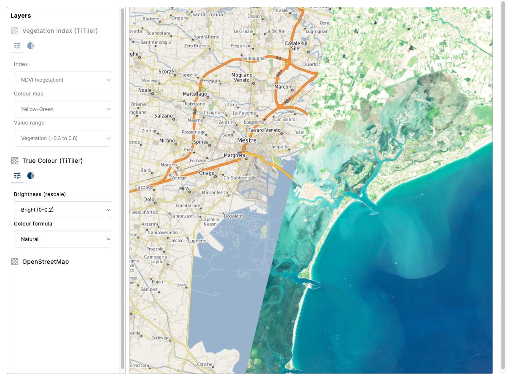
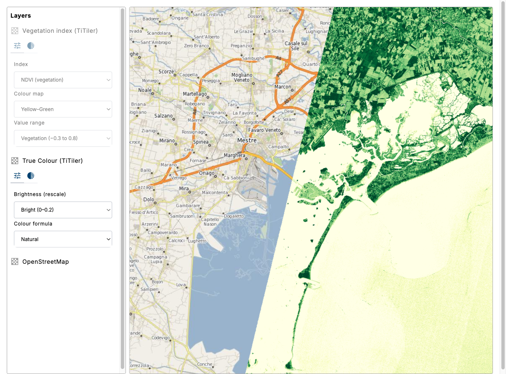

# 04: TiTiler — server-side rendering

In exercises 01-03, the browser read the GeoZarr directly and rendered it with WebGL. **TiTiler** renders the GeoZarr on the server and returns ordinary PNG tiles. To the map, that's a regular `XYZ` tile layer.

This offloads processing (band math, indices, colour pipelines, reprojection) to the server, and works for any client that cannot render GeoZarr directly.

This exercise has two parts:

- **Part A — true colour**: an RGB scene whose brightness and colour pipeline you tune from the layer control.
- **Part B — band math**: a vegetation index computed server-side with an `expression`, coloured with a `colormap`.

## Result



A Sentinel-2 scene over Venice rendered by TiTiler, with a layer-control form that drives server-side re-rendering. Toggle the second layer on for the NDVI vegetation index:



## Import packages

Same as exercise 02 — no GeoZarr source needed this time, since the tiles arrive as PNGs:

- `@eox/layout`
- `@eox/map`
- `@eox/layercontrol`
- `@eox/jsonform`

CDN equivalents:

- `https://unpkg.com/@eox/layout/dist/eox-layout.js`
- `https://unpkg.com/@eox/map/dist/eox-map.js`
- `https://unpkg.com/@eox/layercontrol/dist/eox-layercontrol.js`
- `https://unpkg.com/@eox/jsonform/dist/eox-jsonform.js`

## Add HTML

Reuse the two-panel layout from exercise 02 (layer control + map), with the config tool enabled:

```html
<eox-layercontrol for="eox-map#my-map" tools='["config", "opacity", "info"]'></eox-layercontrol>
```

## Part A — true colour: build the tile URL

TiTiler-EOPF exposes tiles at:

```
{base}/collections/{collection}/items/{item}/tiles/WebMercatorQuad/{z}/{x}/{y}.png
```

Keep `base` (`https://api.explorer.eopf.copernicus.eu/raster`) as a variable. The
`collection` and `item` are both embedded in the GeoZarr URL
(`.../{collection}/{item}.zarr/...`), so derive them with a small helper over
`fetchGeoZarrUrl` for the Venice bbox:

```js
async function getCollectionAndItem(bbox) {
  const url = await fetchGeoZarrUrl(bbox);
  const [, collection, item] = url.match(/\/([^/]+)\/([^/]+)\.zarr\b/) ?? [];
  return { collection, item };
}
```

Query parameters control the rendering:

| Param | Meaning | Example |
|-------|---------|---------|
| `variables` | Band path in the Zarr (repeat once per RGB channel) | `/measurements/reflectance:b04` |
| `rescale` | Min,max reflectance to stretch to 0-255 | `0,0.2` |
| `color_formula` | Colour pipeline | `gamma rgb 1.3, sigmoidal rgb 8 0.1, saturation 1.2` |

The two parameters that shape the visual output are `rescale` and `color_formula`:

- **`rescale`** maps an input reflectance range to 0-255. Surface reflectance is concentrated in the low end, so a tight range like `0,0.2` brightens the scene; widening it (`0,0.5`) darkens it.
- **`color_formula`** is a [rio-color](https://github.com/mapbox/rio-color) pipeline of comma-separated operations applied in order:
  - `gamma rgb 1.3` — lifts midtones
  - `sigmoidal rgb 8 0.1` — S-curve contrast (`8` = strength, `0.1` = midpoint)
  - `saturation 1.2` — increases colour saturation
  Adjust a value or remove an operation to change the output, e.g. `gamma rgb 1.0` for a linear image.

Add this as a `Tile` + `XYZ` layer in `eox-map` (alongside an OSM base), and set `center: [12.33, 45.44]`, `zoom: 11` (Venice).

### Drive the rendering with a layerConfig

Add a `layerConfig` to the TiTiler layer so the layer control can re-render it live. Give the schema properties whose **names match the URL query parameters** you want to control — both `string` `enum`s (dropdowns) with friendly `options.enum_titles`:

- `rescale` — `["0,0.1", "0,0.2", "0,0.5", "0,0.8"]`, titled "Brightest ... Darker"
- `color_formula` — a few presets titled "Natural / Flat / Vivid"

Set `type: "tileUrl"` on the `layerConfig` and `layerControlToolsExpand: true`. When you change a field, the control rewrites that query parameter on the tile URL and TiTiler re-renders.

This uses the **same `layerConfig` mechanism** as exercise 02. In exercise 02, `type: "style"` drove client-side WebGL style variables; here, `type: "tileUrl"` maps schema fields to source URL query parameters, causing the layer control to rewrite the tile URL and trigger a server-side re-render. One mechanism, two rendering strategies.

## Part B — band math & colour maps

The server can run a **mathematical expression** across bands and colour the single-band result. Add a second `Tile` + `XYZ` layer (start it `visible: false` to skip the initial load) whose URL uses three different parameters:

| Param | Meaning | Example |
|-------|---------|---------|
| `expression` | Band math; reference each band by its Zarr path | `(/measurements/reflectance:b08-/measurements/reflectance:b04)/(/measurements/reflectance:b08+/measurements/reflectance:b04)` |
| `colormap_name` | Named colour ramp applied to the result | `ylgn` |
| `rescale` | Value range of the index → 0-255 | `-0.3,0.8` |

The example above is **NDVI** = (NIR − Red) / (NIR + Red). A few common indices:

| Index | Formula | Bands |
|-------|---------|-------|
| NDVI (vegetation) | (NIR − Red) / (NIR + Red) | b08, b04 |
| NDWI (water) | (Green − NIR) / (Green + NIR) | b03, b08 |
| NBR (burn) | (NIR − SWIR2) / (NIR + SWIR2) | b08, b12 |

Give this layer its own `layerConfig` with three dropdowns: `expression` (the index, with the band-math string as the `enum` value), `colormap_name` (`ylgn`, `viridis`, `blues`, ...), and `rescale` (the value range). Toggle the layer on in the layer control to see the coloured index. Changing the colour map triggers a server-side re-render.

> `expression` replaces `variables` — provide the band math instead of listing channels.

## Compare

Compare with the [solution folder](./solution/).

Next: [05 — eox-storytelling](../05-eox-storytelling/README.md).

## Further reading

- [TiTiler-EOPF raster API](https://api.explorer.eopf.copernicus.eu/raster/api.html)
- [rio-color operations reference](https://github.com/mapbox/rio-color#operations) — gamma, sigmoidal, saturation details
- [TiTiler colormap names](https://developmentseed.org/titiler/endpoints/cog/#available-colormaps) — full list of `colormap_name` values
- [eox-layercontrol config tool](https://eox-a.github.io/EOxElements/?path=/docs/elements-eox-layercontrol--docs)
