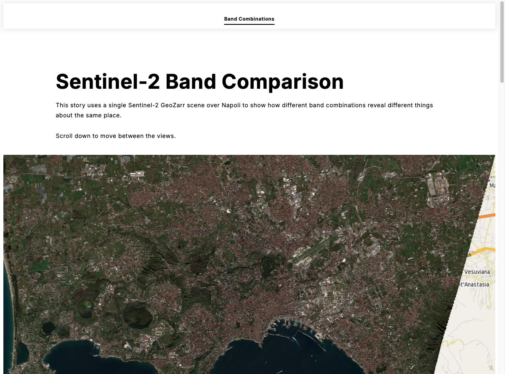

# 05: Storytelling

`eox-storytelling` creates scrollytelling experience using **Markdown**: as the reader scrolls, the map animates between view states you define inline. No layout code, no event wiring — just Markdown with a few special HTML comments.

## Result



A guided tour over Napoli. The same Sentinel-2 GeoZarr scene flips between True Color and SWIR band combinations as you scroll.

## Import packages

- `@eox/storytelling` — the scrollytelling component
- `@eox/map` + `@eox/map/src/plugins/advancedLayersAndSources` — the maps embedded in the story (with GeoZarr support)

CDN equivalent:

```js
import "https://unpkg.com/@eox/storytelling/dist/eox-storytelling.js";
```

## Add HTML

A single element holds the whole story. Point it at a Markdown file with `markdown-url`:

```html
<eox-storytelling id="story" show-nav markdown-url="/05-eox-storytelling/public/story.md"></eox-storytelling>
```

`show-nav` adds the navigation bar across the top.


## Write the story

The story lives in [`05-eox-storytelling/public/story.md`](./public/story.md) and is partially complete — the True Color step is a worked example; you add the SWIR step. Two things make it interactive:

1. **A map section** — a heading annotated with `as="eox-map"`:
   ```
   ## Band Combinations <!--{ as="eox-map" mode="tour" projection="EPSG:3857" }-->
   ```
   `mode="tour"` makes the map sticky while its sub-steps scroll past.

2. **Tour steps** — each `###` heading carries a view state, with the layer array as an inline JSON string (single-quote delimited so the inner double quotes are valid):
   ```
   ### <!--{ layers='[ ...OSM + GeoZarr layers... ]' center="[14.24, 40.83]" zoom="12" }-->
   #### True Color (RGB)
   ...prose...
   ```

Use the same OSM + GeoZarr layer shape as exercise 01. Define two steps over the same scene (URL below), changing only the bands:

- **True Color** — `["b04", "b03", "b02"]`
- **SWIR** — `["b12", "b8a", "b04"]`

GeoZarr URL (Napoli):
```
https://s3.explorer.eopf.copernicus.eu/esa-zarr-sentinel-explorer-fra/tests-output/sentinel-2-l2a-staging/S2A_MSIL2A_20251227T100441_N0511_R122_T33TVF_20251227T121715.zarr/measurements/reflectance
```

## Try it

Scroll between the two steps and watch the same place switch from natural color to SWIR. Then add a third step of your own — a different `center`/`zoom`, or another band combination from exercise 02.

## Solution

Compare with the [solution folder](./solution/).


## Further reading

- [eox-storytelling docs](https://eox-a.github.io/EOxElements/?path=/docs/elements-eox-storytelling--docs) — all supported annotations and modes
