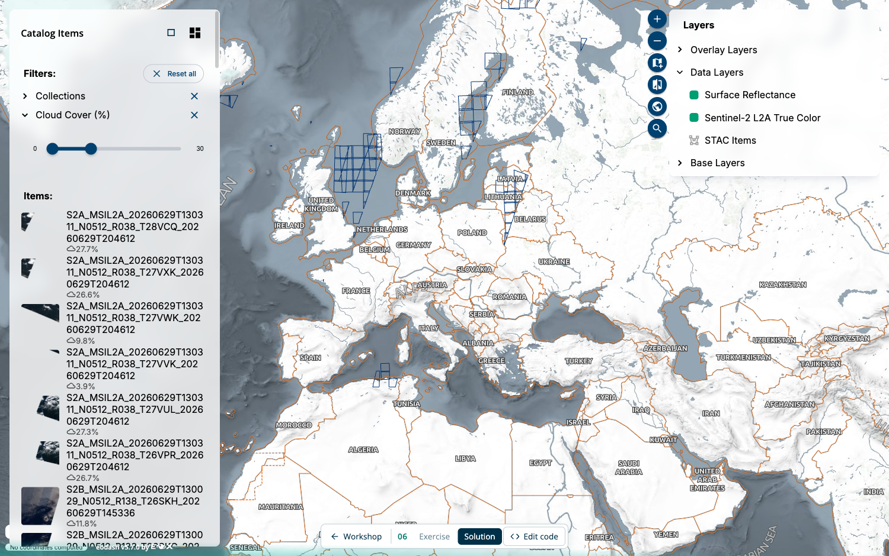

# 06: eodash Dashboard

The previous exercises required explicit wiring: placing a map, adding a layer control, configuring filters. **eodash** handles that orchestration from a single **config object** and a **STAC endpoint**. It builds a full dashboard — map, item catalogue, layer control — with all widgets sharing a central store driven by the STAC catalogue.

The starter ships a working base config that renders a full-bleed map; you grow it by adding the side-panel widgets.


## Result



A STAC-driven dashboard connected to the EOPF Explorer STAC API: a dataset filter on the left, a map in the middle, a layer control on the right — all from a single config.

## Add HTML

```html
<eo-dash id="dashboard"></eo-dash>
```

Give it the full viewport height in CSS (`eo-dash { display: block; height: 100vh; }`).

## Write the config

The whole dashboard is one object. The important keys:

- **`stacEndpoint`** — the single source of truth. eodash queries it to discover collections, populate filters, and figure out how to render each item's assets. For the EOPF Explorer STAC API:
  ```js
  stacEndpoint: { endpoint: "https://api.explorer.eopf.copernicus.eu/stac", api: true }
  ```
- **`brand`** — `name`, `theme.colors` (`primary`, `secondary`, `surface`), and `noLayout: true` to hide eodash's own header/footer (the workshop has its own app bar).
- **`template`** — the layout:
  - `background` — a full-bleed widget, here `{ name: "EodashMap" }`
  - `widgets` — an array of panels, each with an `id`, `type: "internal"`, `title`, a grid `layout` (`{ x, y, w, h }` on the same 12-column grid as `eox-layout`), and a `widget.name`.

The base config provides everything except the panels. Your task is to fill `template.widgets`: add an `EodashItemCatalog` on the left (`x: 0, w: 3`) and an `EodashLayerControl` on the right (`x: 9, w: 3`).

On the layer control, pass `widget.properties` to expose every per-layer tool except the datetime picker (the default is `["datetime", "info", "config", "legend", "opacity"]`):

```js
widget: {
  name: "EodashLayerControl",
  properties: {
     tools: ["info", "config", "legend", "opacity"] 
  },
}
```

## Wire it up

Set the element's `config` property, then register the web component with a dynamic import. Importing it after assigning `config` lets eodash pick up your config as it initialises:

```js
const dashboard = document.querySelector("#dashboard");
dashboard.config = async () => config; // a function returning the config object

await import("@eodash/eodash/webcomponent");
```

## Try it

Pick a an item from the catalogue. The map renders it and the layer control updates. All widgets remain consistent because they share eodash's central store.

Click on the layer to expand the bands editor and update the bands from the geozarr directly.

## Compare

Compare with the [solution folder](./solution/).

Next, try out [section 07](../07-jupyter/README.md).

## Further reading

- [eodash client docs](https://eodash.github.io/eodash/) — config reference, widgets, templates
- `getBaseConfig` from `@eodash/eodash/templates` — start from a `lite` / `explore` / `expert` template instead of a blank config
