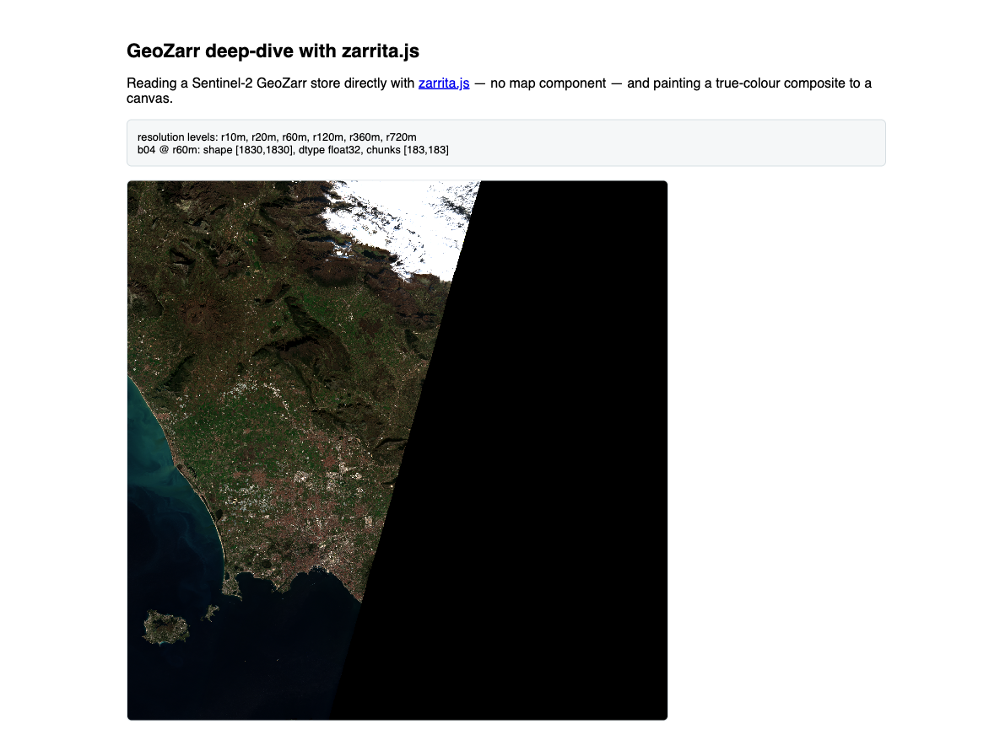

# 08: GeoZarr deep-dive with zarrita.js (optional)

> If-time-permits segment. Every other exercise consumed GeoZarr through a component;
> here we open a store directly and see what is inside.

OpenLayers reads GeoZarr in the browser via [zarrita.js](https://github.com/manzt/zarrita.js).
This exercise uses zarrita directly — no map component — to open a Sentinel-2 store,
read bands into typed arrays, and paint a true-colour composite onto a `<canvas>`.

The starter provides the canvas rendering (`paintComposite` and `showMeta`).
Your task is the zarrita code: open the store and read the bands.

## Result



The store's resolution levels and the band's shape/dtype/chunks, plus the 60 m
true-colour composite drawn straight from the raw arrays.

## Import

```js
import * as zarr from "zarrita";
```

## Open the store

A `.zarr` is a tree of **groups** and **arrays** accessed over HTTP. Open it with a
`FetchStore`, then resolve into the `measurements/reflectance` group:

```js
const store = new zarr.FetchStore(root); // root = the .zarr URL
const rootGroup = await zarr.open(store, { kind: "group" });
const reflectance = await zarr.open(rootGroup.resolve("measurements/reflectance"), { kind: "group" });
```

`reflectance.attrs.multiscales` lists the resolution levels (`r10m`, `r20m`, `r60m`, …).

## Read a band

Use the **60 m** overview — it fits in the browser as a single chunk (the 10 m level
is ~480 MB per chunk). `zarr.get` returns the data as a typed array:

```js
const array = await zarr.open(reflectance.resolve("r60m/b04"), { kind: "array" });
const chunk = await zarr.get(array); // { data: Float32Array, shape, stride }
```

Read `b04`, `b03`, `b02` for a true-colour composite.

## Paint to the canvas

Once you have read the three bands, pass them to `paintComposite`:

```js
paintComposite(red, green, blue);
```

It sets the canvas dimensions from the band shape, builds an `ImageData`, and
maps each reflectance value to 0-255 via `(v / 0.3) * 255` (clamped).
`showMeta([...])` writes resolution levels and a band's shape/dtype/chunks into
the info panel.

## Why this helps

Working through what `eox-map` abstracts — fetch metadata, select a resolution level,
read chunks, normalise, draw pixels — makes the earlier exercises more concrete. It
also illustrates why a small overview loads quickly while full-resolution chunks are
expensive, and why band math and reprojection are often better handled server-side
(see exercise 04).

## Compare

Check your result against the [solution folder](./solution/).

## Further reading

- [zarrita.js](https://github.com/manzt/zarrita.js) — the GeoZarr reader used here and inside eox-map
- [GeoZarr specification](https://github.com/zarr-developers/geozarr-spec)
